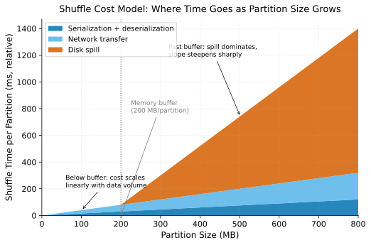

# The Cost Model of Shuffle

> **Shuffle cost = serialization + disk spill + network transfer + deserialization, and
> each term scales differently.** Treating "shuffle" as one undifferentiated cost is why
> shuffle tuning so often addresses the wrong bottleneck — the fix for a
> network-bound shuffle can make a disk-bound one worse, and vice versa.

## The four terms

A shuffle moves the output of upstream tasks (map-side) to downstream tasks
(reduce-side), repartitioned by key. Each row that participates pays four costs, not
one:

**Serialization (upstream, CPU-bound).** Every row written to a shuffle file is
converted from in-memory object representation to bytes. This cost scales with row
count and schema complexity (nested/variable-length fields cost more than fixed-width
ones), and is paid once per row regardless of how far the bytes travel afterward.

**Disk spill (upstream and downstream, I/O-bound).** Shuffle data that doesn't fit in
the write or read buffer is spilled to local disk, sorted or merged, and read back. This
cost scales with *how much exceeds memory*, not with total data volume — a shuffle that
fits entirely in memory pays zero spill cost, and one that exceeds it by 20% can still
trigger a full sort-and-merge pass over everything. See
[Spill to Disk](../patterns/joins-and-shuffle/spill-to-disk.md).

**Network transfer (cross-node, bandwidth-bound).** Bytes travel from the node that
produced them to the node that will consume them. This cost scales with data volume
and inversely with locality (see
[Partitioning & Data Locality](partitioning-and-data-locality.md)) — same-rack transfer
is materially cheaper than cross-AZ, which is itself cheaper than cross-region.
Contention matters too: a shuffle isn't the only tenant on the network fabric, and
its transfer time is a function of what else is shuffling concurrently.

**Deserialization (downstream, CPU-bound).** The mirror of serialization, paid again on
the read side before the reduce task can operate on the data.

Below the reduce-side memory buffer, cost scales linearly with data volume —
serialization and network transfer dominate. Past the buffer, disk spill takes over and
the slope steepens sharply: the same *linear* growth in partition size produces
*superlinear* growth in shuffle time, because every excess byte is now paying for a
sort-and-merge pass on top of the transfer cost it already owed.

## Why partition count is the primary lever

Partition count controls per-partition size, and per-partition size determines which of
the four terms dominates:

- **Too few partitions:** each partition is large, more likely to exceed memory and
  spill, and a single slow or skewed partition holds up the whole stage. Large
  partitions also reduce parallelism — fewer, bigger units of work means fewer
  concurrent tasks.
- **Too many partitions:** each partition is small, so spill risk drops, but
  serialization and network overhead are now dominated by fixed per-partition costs
  (file handles, network round-trips, task scheduling overhead) rather than by
  useful data movement. At the extreme, task scheduling overhead exceeds task runtime.

There is no fixed correct partition count — it's a function of total shuffle volume,
available memory per executor, and cluster network topology, which is why adaptive
systems recompute it at runtime rather than accepting a static config value. See
[Adaptive Query Execution (AQE)](../patterns/spark-internals/adaptive-query-execution.md)
and
[Shuffle Partitioning Strategy](../patterns/joins-and-shuffle/shuffle-partitioning-strategy.md).

## Skew breaks the cost model's assumptions

The cost model above assumes each partition receives a roughly equal share of data. Key
skew violates that assumption directly: one partition can carry 100x the data of its
neighbors while the partition *count* stays exactly the average size the planner
expected. The result is a shuffle whose aggregate metrics (total bytes shuffled, average
partition size) look unremarkable while one task spills heavily and runs an order of
magnitude longer than the rest. See
[Data Skew & Salting](../patterns/joins-and-shuffle/data-skew-and-salting.md).

## Push-based and external shuffle change the constants, not the shape

External shuffle services (Spark's, or newer disaggregated/push-based shuffle designs
used at LinkedIn, Uber, and elsewhere) decouple shuffle data from the executor
lifecycle and, in push-based variants, merge shuffle blocks server-side before the read
phase. This reduces the number of network round-trips (small random reads become
larger sequential ones) and removes shuffle data loss on executor eviction — but it does
not remove any of the four cost terms. It changes their coefficients, not their
existence. See
[Shuffle Service Internals](../patterns/joins-and-shuffle/shuffle-service-internals.md).

## Connections to other foundations

[Partitioning & Data Locality](partitioning-and-data-locality.md) explains why the
network term exists at all — shuffle is what happens when co-location isn't available.
[Batch vs. Streaming](batch-vs-streaming-spectrum.md) shows how streaming systems pay a
version of this same cost continuously and incrementally rather than once per job, which
is why streaming shuffle (repartitioning a Kafka topic, rebalancing consumer groups)
has a latency-spike signature rather than a single big cost at job start.
