```mermaid
graph TD
    data-skew-and-salting["Data Skew And Salting"] -->|"skew × oversized partition → spill"| spill-to-disk["Spill To Disk"]
    adaptive-query-execution["Adaptive Query Execution"] -->|"runtime statistics × skew detection"| data-skew-and-salting["Data Skew And Salting"]
    statistics-and-cardinality-estimation["Statistics And Cardinality Estimation"] -->|"bad estimates × many joins → compounding error"| join-ordering["Join Ordering"]
    backpressure-in-streaming["Backpressure In Streaming"] -->|"sustained lag × growing replay window"| checkpointing-and-fault-tolerance["Checkpointing And Fault Tolerance"]
    watermarks-and-late-data["Watermarks And Late Data"] -->|"conservative watermark × unbounded state growth"| stateful-processing-and-state-stores["Stateful Processing And State Stores"]
    compaction-strategies["Compaction Strategies"] -->|"small-file backlog × listing cost"| object-store-characteristics["Object Store Characteristics"]
    table-formats-and-metadata-layers["Table Formats And Metadata Layers"] -->|"metadata bloat × coordinator planning cost"| distributed-query-coordination["Distributed Query Coordination"]
    secondary-indexes-and-write-amplification["Secondary Indexes And Write Amplification"] -->|"index write cost × shared I/O budget"| index-maintenance-vs-compaction["Index Maintenance Vs Compaction"]
    hot-partition-handling["Hot Partition Handling"] -->|"same power-law skew, batch and serving"| data-skew-and-salting["Data Skew And Salting"]
    read-replicas-and-staleness["Read Replicas And Staleness"] -->|"replication lag × training-serving skew"| feature-store-serving["Feature Store Serving"]
    query-admission-control["Query Admission Control"] -->|"no admission control × one bad query, whole cluster"| straggler-queries-and-resource-isolation["Straggler Queries And Resource Isolation"]
    btree-vs-lsm-tree["Btree Vs Lsm Tree"] -->|"LSM write throughput × state store design"| stateful-processing-and-state-stores["Stateful Processing And State Stores"]
    memory-management["Memory Management"] -->|"storage-memory borrowing × execution headroom"| spill-to-disk["Spill To Disk"]
    vectorized-execution["Vectorized Execution"] -->|"UDF breaks both optimizations at once"| serialization-and-tungsten["Serialization And Tungsten"]
    query-federation["Query Federation"] -->|"federation boundary defeats pushdown"| predicate-and-projection-pushdown["Predicate And Projection Pushdown"]
```

# Interaction Map

Patterns rarely fail in isolation. This map shows which patterns compound and why.

---

---

## High-value compounds

### Data skew × spill-to-disk

A skewed key sends a disproportionate share of rows to a single partition. That
partition is far more likely to individually exceed the per-task memory budget than
the job's *average* partition size would suggest — so a job whose aggregate shuffle
metrics look completely unremarkable can still spill heavily on exactly one task,
and that one task sets the stage's wall-clock time. See
[Data Skew & Salting](patterns/joins-and-shuffle/data-skew-and-salting.md) and
[Spill to Disk](patterns/joins-and-shuffle/spill-to-disk.md).

### AQE × data skew

Adaptive Query Execution's skew-join optimization is, structurally, automated
salting: it detects oversized partitions from *measured* runtime shuffle statistics
rather than compile-time estimates, and splits them without requiring an engineer to
identify and manually salt the hot key. See
[Adaptive Query Execution (AQE)](patterns/spark-internals/adaptive-query-execution.md).

### Statistics error × join ordering

Cardinality estimation error doesn't average out across a multi-way join — it
compounds multiplicatively, because each join's own cardinality estimate is computed
using the (already erroneous) upstream estimate as an input. A query with five joins
is far more exposed to a single bad early estimate than a two-table join would be. See
[Statistics & Cardinality Estimation](patterns/sql-execution/statistics-and-cardinality-estimation.md)
and [Join Ordering](patterns/sql-execution/join-ordering.md).

### Backpressure × checkpoint replay window

A pipeline under sustained backpressure accumulates unprocessed data for as long as
the mismatch persists. That accumulation directly increases the replay window a
checkpoint-based recovery would have to reprocess after a failure — the longer a
pipeline has been falling behind, the more expensive its next failure becomes. See
[Backpressure in Streaming](patterns/streaming/backpressure-in-streaming.md) and
[Checkpointing & Fault Tolerance](patterns/streaming/checkpointing-and-fault-tolerance.md).

### Conservative watermarks × unbounded state growth

A watermark set to wait longer for late-arriving data keeps windows open longer to
maintain completeness. Every window still open is still holding state, so a
conservative watermark setting directly and continuously trades away state-store
memory for completeness. See
[Watermarks & Late Data](patterns/streaming/watermarks-and-late-data.md) and
[Stateful Processing & State Stores](patterns/streaming/stateful-processing-and-state-stores.md).

### Compaction backlog × object-store listing cost

Falling behind on compaction doesn't just leave data in smaller, less efficient
files — it multiplies the number of listing and per-request operations a query has to
pay against the object store, since each additional file adds its own request
overhead. The backlog's true cost is realized on the read side, not the write side. See
[Compaction Strategies](patterns/storage/compaction-strategies.md) and
[Object Store Characteristics](patterns/storage/object-store-characteristics.md).

### Metadata bloat × coordinator planning cost

A table's accumulated transaction log or manifest metadata has to be resolved before
a query coordinator can even determine the current file set — so metadata growth adds
directly to planning latency on a shared coordinator, independent of how much actual
data the query needs to scan. See
[Table Formats & Metadata Layers](patterns/storage/table-formats-and-metadata-layers.md)
and [Distributed Query Coordination](patterns/query-systems/distributed-query-coordination.md).

### Secondary index write cost × compaction I/O contention

Every secondary index adds its own write and compaction burden on top of the primary
structure's. That burden competes directly with general storage compaction for the
same underlying I/O budget — two independently tuned maintenance costs sharing one
finite resource, often without either configuration being aware of the other. See
[Secondary Indexes & Write Amplification](patterns/indexing/secondary-indexes-and-write-amplification.md)
and [Index Maintenance vs. Compaction Interplay](patterns/indexing/index-maintenance-vs-compaction.md).

### Hot partitions in serving × data skew in batch

The same power-law key distribution that produces a batch-job straggler produces a
live serving hot partition — the underlying mechanism is identical, only the cost
differs: a slow task that eventually completes, versus degraded live latency for as
long as the key stays hot. See
[Hot Partition Handling in Serving](patterns/serving/hot-partition-handling.md) and
[Data Skew & Salting](patterns/joins-and-shuffle/data-skew-and-salting.md).

### Replication lag × training-serving skew

An online feature store backed by a lagging read replica or a stale materialization
pipeline serves feature values that diverge from what a model saw during training —
replication staleness and training-serving skew are the same underlying
read-your-writes problem, manifesting in a model-serving context. See
[Read Replicas & Staleness](patterns/serving/read-replicas-and-staleness.md) and
[Feature Store Serving](patterns/serving/feature-store-serving.md).

### No admission control × one query, whole cluster

Without admission control to reject or queue a resource-heavy query before it starts,
a single badly-planned or skewed query can consume a disproportionate share of shared
cluster resources, degrading every other concurrent query — a lack of gatekeeping at
the front door removes the isolation that would otherwise contain the blast radius.
See [Query Admission Control & Workload Management](patterns/query-systems/query-admission-control.md)
and [Straggler Queries & Resource Isolation](patterns/query-systems/straggler-queries-and-resource-isolation.md).

### LSM-tree write throughput × state store design

Most stream-processing state stores are built on LSM-tree engines specifically for
their write-throughput characteristics under continuous, high-frequency updates —
which means state store recovery time and compaction behavior directly inherit
LSM's own write/read amplification tradeoff, not a separate, independently-tunable
concern. See [B-Tree vs. LSM-Tree Tradeoffs](patterns/indexing/btree-vs-lsm-tree.md)
and [Stateful Processing & State Stores](patterns/streaming/stateful-processing-and-state-stores.md).

### Storage-memory borrowing × execution headroom

Caching an unrelated dataset elsewhere in the same application occupies storage
memory that execution could otherwise have borrowed under unified memory management.
This tightens the effective budget available to a shuffle or aggregation running
concurrently, making spill more likely at a data volume that would otherwise have
fit comfortably — two operations that look unrelated in the code, coupled through a
shared memory pool. See
[Memory Management](patterns/spark-internals/memory-management.md) and
[Spill to Disk](patterns/joins-and-shuffle/spill-to-disk.md).

### A single UDF defeats two optimizations at once

A row-at-a-time user-defined function is opaque to both the vectorized execution
engine and whole-stage code generation simultaneously, forcing a fallback to
row-at-a-time, JVM-object-based processing for the surrounding operator chain in both
systems at once — the loss is compounded, not just doubled, because the two
optimizations were designed to work together. See
[Vectorized Execution](patterns/sql-execution/vectorized-execution.md) and
[Serialization & Tungsten](patterns/spark-internals/serialization-and-tungsten.md).

### Query federation × pushdown

Pushdown optimizations that work well within a single engine frequently don't cross a
query federation boundary, since they depend on a specific connector's ability to
translate a filter into the remote source's native query language — a federated
query is only as optimizable as its weakest connector, regardless of how well the
federating engine itself optimizes. See
[Query Federation Across Engines](patterns/query-systems/query-federation.md) and
[Predicate & Projection Pushdown](patterns/sql-execution/predicate-and-projection-pushdown.md).
