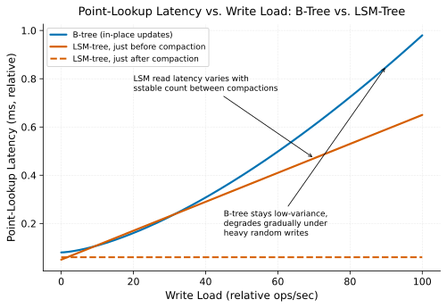

# B-Tree vs. LSM-Tree Tradeoffs

> **One-liner:** B-trees optimize for read latency with in-place updates; LSM-trees optimize for write throughput by deferring merge work — the choice shapes everything built on top.

## Symptom

- A write-heavy workload against a B-tree-backed store shows write amplification and
  latency degradation as random-write in-place updates fragment the tree's pages.
- An LSM-tree-backed store's read latency is noticeably higher and more variable than a
  B-tree store's for the same point-lookup workload, especially before compaction has
  run recently.
- Disk usage for an LSM-tree store temporarily spikes well above its logical data size
  during and immediately after a large compaction pass.
- Migrating a workload from a B-tree-backed engine to an LSM-tree-backed one (chasing
  write throughput) introduces new, previously absent read-latency variability that
  wasn't anticipated during the migration.

## Mechanism

Both structures solve the same problem — maintaining a sorted, efficiently searchable
index — with opposite priorities about when to pay the cost of keeping data organized.

**B-trees** keep data sorted at all times: an insert or update finds its correct
position in the tree and modifies it in place (or splits a page if it's full),
maintaining sortedness continuously. This means reads are efficient and predictable —
a lookup always traverses a bounded number of levels to find its target — but writes,
especially random writes, can require touching and rewriting whole pages for even a
small logical change, and heavy random-write workloads cause page fragmentation that
degrades both write and read performance over time without periodic reorganization.

**LSM-trees** (Log-Structured Merge-trees) defer this cost: writes are appended
sequentially to an in-memory structure (a memtable) and periodically flushed to disk as
immutable, sorted files (sstables), with no attempt to merge or reorganize at write
time. This makes writes very cheap — sequential appends rather than in-place random
updates — at the cost of read complexity: because data for a given key might exist in
the memtable, or in any of several sstables at different levels (not yet merged
together), a read potentially has to check multiple locations, and a range scan has to
merge results across all of them. Compaction (see
[Compaction Strategies](../storage/compaction-strategies.md)) periodically merges these
sstables to bound this read-side cost, but the cost hasn't disappeared — it's been
deferred and batched, paid at compaction time rather than at write time, which is
exactly the write-amplification-versus-read-amplification tradeoff explored in that
page.

B-tree lookup latency stays low and degrades only gradually under heavy random-write
load. LSM-tree lookup latency is bimodal: it depends on how many unmerged sstables have
accumulated since the last compaction, so the same read can be markedly slower right
before a compaction pass than right after one.

The practical consequence: LSM-trees suit write-heavy workloads (high-throughput
ingestion, time-series data, event logs) where write latency and throughput matter more
than the read-side complexity cost, while B-trees suit read-heavy or read-latency-
sensitive workloads where predictable, low-variance point-lookup performance matters
more than absorbing high write throughput cheaply. This is exactly why streaming state
stores (see [Stateful Processing & State Stores](../streaming/stateful-processing-and-state-stores.md))
lean on LSM-based engines — their dominant access pattern is high-throughput,
continuously updated state — while traditional OLTP databases have historically
defaulted to B-tree indexes, where point-lookup latency predictability is paramount.

## Real-world sightings

The original LSM-tree paper (O'Neil et al., "The Log-Structured Merge-Tree
(LSM-Tree)," Acta Informatica, 1996) explicitly frames the design around exactly this
tradeoff: deferring and batching the cost of maintaining a sorted structure in exchange
for converting random writes into sequential ones, at the acknowledged cost of more
complex, potentially multi-location reads.

RocksDB's own design documentation (RocksDB being one of the most widely embedded
LSM-tree implementations, underlying many stream-processing state stores and other
embedded database use cases) explicitly discusses this B-tree/LSM-tree tradeoff as the
motivating design rationale, and documents multiple compaction strategies (as covered
in [Compaction Strategies](../storage/compaction-strategies.md)) specifically to let
operators tune where on the write/read amplification spectrum their deployment sits.

## Mitigations

### Choosing the storage engine to match the workload's dominant operation

**What it is:** Select a B-tree-backed engine for read-latency-sensitive,
point-lookup-heavy workloads and an LSM-tree-backed engine for write-throughput-heavy
workloads, rather than defaulting to one engine type regardless of workload shape.

**Cost:** Requires understanding the actual dominant access pattern at design time,
which may shift as an application's usage matures.

**How it backfires:** A workload's read/write balance can shift meaningfully after the
engine choice is made (an application that starts write-heavy during initial ingestion
and becomes read-heavy once mature), and migrating storage engines later is a
significant undertaking, not a configuration change.

### Tuning LSM compaction strategy to the actual read/write ratio

**What it is:** For LSM-backed systems, choose leveled compaction (lower read
amplification, higher write amplification) or size-tiered compaction (the reverse)
based on the workload's actual balance. See
[Compaction Strategies](../storage/compaction-strategies.md).

**Cost:** Requires ongoing monitoring and potential re-tuning as workload
characteristics evolve.

**How it backfires:** A compaction strategy tuned for one phase of a workload's life
(bulk ingestion) can be poorly suited to a later phase (steady-state serving) of the
same system.

### Accepting B-tree write cost for read-latency-critical systems

**What it is:** For systems where read-latency predictability is the dominant
requirement, accept B-tree's higher per-write cost rather than migrating to an
LSM-tree engine purely for write throughput gains that aren't actually needed.

**Cost:** Forgoes the write-throughput ceiling LSM-trees offer, which matters if write
volume grows substantially later.

**How it backfires:** None specific to making this deliberate choice correctly — the
risk is in *not* deliberately evaluating this tradeoff and instead defaulting to
whichever engine is fashionable or familiar, regardless of workload fit.

## Interactions

- [Compaction Strategies](../storage/compaction-strategies.md) — the direct mechanism
  LSM-trees use to bound read amplification, and the source of the write-vs-read
  amplification tradeoff described here.
- [Stateful Processing & State Stores](../streaming/stateful-processing-and-state-stores.md) —
  a widely encountered real-world application of LSM-tree-backed storage, chosen
  specifically for its write-throughput characteristics.
- [Secondary Indexes & Write Amplification](secondary-indexes-and-write-amplification.md) —
  a related but distinct write-amplification concern, arising from maintaining
  additional indexes rather than from the primary index structure's own design.

## References

- O'Neil, P. et al. *The Log-Structured Merge-Tree (LSM-Tree)*. Acta Informatica, 1996.
  The foundational LSM-tree design paper.
- Comer, D. *The Ubiquitous B-Tree*. ACM Computing Surveys, 1979. Foundational
  reference on B-tree design and its read/write characteristics.
- RocksDB Documentation. *RocksDB Overview* and *Compaction*. Practical design
  discussion of LSM-tree tradeoffs in a widely embedded implementation.
