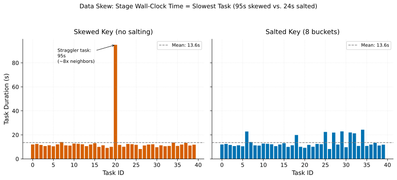

# Data Skew & Salting

> **One-liner:** A single hot key can send one task's runtime to ten times its neighbors', and salting is the standard but imperfect fix.

## Symptom

- In the execution UI, one task in a stage runs far longer than the rest — the
  stage's task duration distribution has a long tail of one or a handful of stragglers
  while most tasks finish quickly.
- Aggregate shuffle metrics (total bytes shuffled, average partition size) look
  unremarkable, but the job's wall-clock time is dominated by a small number of slow
  tasks.
- Increasing the cluster's core count doesn't shorten the job, because the bottleneck
  task can't be split further — it's already the minimum unit of work for that key.
- A join or `groupBy` on a specific column (user ID, product ID, null/default sentinel
  values) is reliably the slow stage, regardless of other query changes.

## Mechanism

Partitioning (see [Partitioning & Data Locality](../../foundations/partitioning-and-data-locality.md))
assigns rows to partitions by key, and every partitioning scheme implicitly assumes
that keys are distributed roughly evenly. Real-world key distributions are almost never
even — they follow power laws. A small number of keys (a popular product, a bot
account, a `NULL`/default sentinel value used for missing data) can account for a
disproportionate share of rows.

When such a key exists, every row with that key hashes to the same partition, no matter
how many partitions the job is configured to use. That partition's task has to process
far more data than its neighbors, and — critically — it cannot be parallelized further
by adding more partitions or more executors, because a single key's rows cannot be split
across tasks in a standard hash-partitioned shuffle. The job's wall-clock time becomes
bounded by that one task, regardless of how much idle capacity the rest of the cluster
has.

The skewed case shows a stage whose wall-clock time is set entirely by one straggler
task processing a disproportionate share of the data; the salted case shows the same
total extra work redistributed across several tasks, which lowers the stage's maximum
task duration even though total cluster work is unchanged — parallelism, not total
work, was the bottleneck.

This is distinct from a straggler caused by a slow node (see
[Speculative Execution & Stragglers](../spark-internals/speculative-execution-and-stragglers.md)):
skew produces a slow task even on a perfectly healthy, evenly-loaded cluster, because
the imbalance is in the data, not the hardware. Speculative execution — Spark's
standard remedy for slow-node stragglers — does nothing for a skew straggler, because
re-running the same oversized partition on a different node still has to process the
same oversized partition.

**Salting** addresses this by artificially splitting a hot key into several sub-keys
(appending a random or round-robin "salt" value to the join key on one side, and
exploding the other side to match every possible salt value), so that a single logical
key's rows are distributed across multiple physical partitions. This restores
parallelism for the hot key at the cost of increased shuffle volume (the exploded side)
and added query complexity.

## Real-world sightings

Salting for skewed joins is one of the most widely documented Spark performance
patterns in production engineering blogs — Uber, Airbnb, LinkedIn, and numerous other
companies running Spark at scale have published internal case studies describing key
skew (frequently from bot traffic, default/null values, or a small number of extremely
popular entities) as a recurring, expensive production issue that standard
repartitioning does not fix.

Spark's own adaptive execution work (tracked as SPARK-29544, "Optimize skew join at
runtime") added automatic skew join handling to Adaptive Query Execution specifically
because manual salting was common enough in production Spark SQL workloads to justify
building the split-and-replicate logic directly into the engine, triggered by runtime
partition-size statistics rather than requiring engineers to detect and salt skewed keys
by hand.

## Mitigations

### Manual salting

**What it is:** Append a random salt to the skewed side's join key and explode the
other side across all salt values, splitting one hot partition into several smaller
ones.

**Cost:** Increases shuffle volume on the exploded side by a factor equal to the number
of salt buckets, and adds query complexity that has to be maintained as the skewed key
set changes over time.

**How it backfires:** Salting requires knowing in advance which keys are skewed and by
how much; a fixed salt-bucket count tuned for today's skew can be wrong (too few
buckets, still skewed; too many, needless overhead) after the underlying data
distribution shifts, and nothing signals that the salting configuration has gone stale.

### Automatic skew join optimization (AQE)

**What it is:** Let the engine detect oversized partitions from runtime shuffle
statistics and automatically split them, without manual salting. See
[Adaptive Query Execution (AQE)](../spark-internals/adaptive-query-execution.md).

**Cost:** Only applies within a single job's shuffle boundaries — it doesn't propagate
skew awareness to a downstream job reading this job's output.

**How it backfires:** Threshold-based skew detection (a partition is "skewed" if it
exceeds some multiple of the median partition size) can miss skew that's proportionally
large but doesn't cross the configured threshold, or can trigger unnecessary splitting
on a workload whose natural partition-size variance is high but not actually a
performance problem.

### Isolating known hot keys

**What it is:** Filter out a small number of known extreme keys, process them
separately (often via broadcast join against just those keys), and union the results
back with the bulk join.

**Cost:** Requires maintaining a list of "known hot keys," which is itself a piece of
operational state that can drift.

**How it backfires:** New hot keys emerge (a product goes viral, a new bot pattern
appears) that aren't on the known list, and the isolation logic provides no benefit —
worse, it can create a false sense that skew has been "handled" structurally when it's
only been handled for last quarter's hot keys.

## Interactions

- [Spill to Disk](spill-to-disk.md) — a skewed partition is far more likely to exceed
  its memory budget and spill, compounding the straggler's runtime with spill cost on
  top of raw data volume.
- [Speculative Execution & Stragglers](../spark-internals/speculative-execution-and-stragglers.md) —
  looks like the same symptom (one slow task) but is not fixed by the same mitigation;
  distinguishing skew from a genuinely slow node is the first diagnostic step.
- [Shuffle Partitioning Strategy](shuffle-partitioning-strategy.md) — increasing
  partition count does not help skew, since the hot key still hashes to one partition
  regardless of how many partitions exist.

## References

- Apache Spark JIRA, SPARK-29544. *Optimize skew join at runtime*. The design and
  implementation of AQE's automatic skew join handling.
- Databricks Engineering Blog. *Adaptive Query Execution: Speeding Up Spark SQL at
  Runtime*. Covers the skew-join optimization alongside join-strategy conversion and
  partition coalescing.
- DeWitt, D. and Gray, J. *Parallel Database Systems: The Future of High Performance
  Database Systems*. Communications of the ACM, 1992. Early, still-relevant treatment
  of data skew as a fundamental limit on partitioned parallelism.
