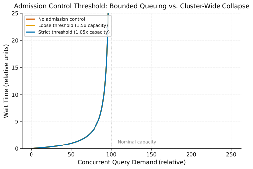

# Query Admission Control & Workload Management

> **One-liner:** Without admission control, queries are accepted until the cluster runs out of memory rather than being queued or rejected earlier and cheaply.

## Symptom

- A shared analytical cluster experiences a sudden, cluster-wide slowdown or crash
  traceable to a burst of concurrently submitted queries, none individually
  problematic, but collectively exceeding available memory or compute.
- Query failures under load manifest as out-of-memory errors deep into execution,
  after significant compute has already been spent, rather than as an immediate,
  cheap rejection at submission time.
- One team's ad-hoc, unpredictable query load degrades performance for other teams'
  scheduled, predictable workloads sharing the same cluster, with no isolation between
  them.
- Cluster utilization metrics show the system was, in aggregate, over capacity for a
  sustained period before the eventual failure, with no earlier signal that would have
  allowed a graceful response.

## Mechanism

A query engine without admission control accepts every submitted query for execution
and lets each fight for resources (memory, CPU, I/O) with whatever else happens to be
running concurrently, on a best-effort basis, until aggregate demand exceeds available
capacity — at which point the failure mode is typically abrupt and expensive: an
out-of-memory error partway through execution, after substantial compute has already
been invested in query planning and partial execution, rather than a cheap rejection
before any work began.

Admission control inverts this by evaluating whether a query *should* be allowed to
start, based on estimated resource requirements and current cluster load, before
committing execution resources to it. This mirrors the general principle of shedding
or queuing excess demand explicitly rather than letting it accumulate invisibly — the
same principle underlying [Backpressure in Streaming](../streaming/backpressure-in-streaming.md),
applied here to discrete query admission rather than continuous stream processing.

Without admission control, wait time (and eventually failure) explodes non-linearly as
demand approaches and exceeds capacity, degrading every concurrent query at once. A
strict admission threshold instead queues excess demand predictably — individual
queries wait longer, but the cluster as a whole never collapses.

The core difficulty is that admission decisions require *estimating* a query's
resource needs before it runs, and that estimation inherits all the fragility of
[Statistics & Cardinality Estimation](../sql-execution/statistics-and-cardinality-estimation.md):
an admission control system that under-estimates a query's actual resource
requirements will admit it, and the query will still exhaust resources mid-execution,
just as it would have without admission control — the mitigation only helps to the
extent its resource estimates are trustworthy.

Workload management extends this beyond simple accept/reject decisions into
prioritization and isolation: partitioning cluster capacity across workload classes
(interactive/ad-hoc vs. scheduled/batch, or per-team quotas) so that one class's
unpredictable demand can't unboundedly starve another's predictable, planned capacity
needs — the same multitenancy isolation problem addressed at the request level in
[Query Queueing & Fair Scheduling](query-queueing-and-fair-scheduling.md), applied here
at the admission decision itself.

## Real-world sightings

Presto/Trino's and Apache Impala's resource group / admission control features are
explicitly documented as mechanisms for queuing or rejecting queries based on
estimated memory requirements and current cluster load, motivated directly by the
production experience of clusters becoming unstable under unmanaged, unbounded
concurrent query admission — both systems' documentation frames this as a necessary
production hardening step for multi-tenant analytical clusters, not an optional
tuning knob.

Apache Hive's and Spark's own resource-management integrations with cluster schedulers
(YARN queues, Kubernetes resource quotas) serve a related purpose at a coarser
granularity — allocating cluster-wide capacity across competing workloads before
individual query admission decisions are even made — reflecting that admission
control operates at multiple layers (cluster-level quota allocation, and
query-level admission within a quota) rather than as a single mechanism.

## Mitigations

### Memory-estimate-based admission control

**What it is:** Reject or queue queries whose estimated memory requirement, combined
with currently running queries' estimated usage, would exceed cluster capacity, before
committing execution resources.

**Cost:** Requires reasonably accurate memory estimation, which inherits cardinality
estimation's general fragility (see
[Statistics & Cardinality Estimation](../sql-execution/statistics-and-cardinality-estimation.md)).

**How it backfires:** A systematically under-estimating admission control system
provides a false sense of protection — it admits queries that then exceed actual
capacity anyway, and the failure looks the same as having no admission control at all,
just with an extra, ineffective check beforehand.

### Workload-class resource partitioning

**What it is:** Partition cluster capacity across workload classes (interactive vs.
batch, or per-team) with separate quotas, so one class's demand surge can't unboundedly
starve another's.

**Cost:** Static partitioning can leave one class's quota underutilized while another
is queuing, if the split doesn't match actual, current relative demand.

**How it backfires:** A partition scheme sized for historical relative demand between
workload classes becomes miscalibrated as one class's usage grows disproportionately,
requiring ongoing rebalancing that's easy to defer.

### Graceful queuing over hard rejection where feasible

**What it is:** Queue excess query demand up to a bounded wait time rather than
outright rejecting it, giving transient demand spikes a chance to resolve without
requiring the submitter to retry manually.

**Cost:** Queued queries add latency, and a queue with no depth limit reintroduces the
unbounded-buffer risk described in
[Backpressure in Streaming](../streaming/backpressure-in-streaming.md), just applied to
queries instead of stream messages.

**How it backfires:** A queue depth or wait-time limit set too generously effectively
becomes unbounded under sustained demand, delaying the moment admission control
actually protects the cluster until queue exhaustion is itself a crisis.

## Interactions

- [Backpressure in Streaming](../streaming/backpressure-in-streaming.md) — the same
  "shed or queue excess demand explicitly" principle, applied to discrete query
  admission instead of continuous stream processing.
- [Statistics & Cardinality Estimation](../sql-execution/statistics-and-cardinality-estimation.md) —
  the estimation quality admission control's memory-based decisions directly depend
  on.
- [Query Queueing & Fair Scheduling](query-queueing-and-fair-scheduling.md) — the
  complementary mechanism for deciding, among admitted or queued queries, which runs
  next and with what share of resources.

## References

- Presto/Trino Documentation. *Resource Groups*. Describes memory-estimate-based
  admission control and per-workload-class resource partitioning.
- Apache Impala Documentation. *Admission Control and Query Queuing*. Describes
  queuing and rejection behavior under estimated resource pressure.
- Apache Hadoop YARN Documentation. *Capacity Scheduler*. Describes cluster-level
  quota allocation across competing workloads, a coarser-grained complement to
  query-level admission control.
