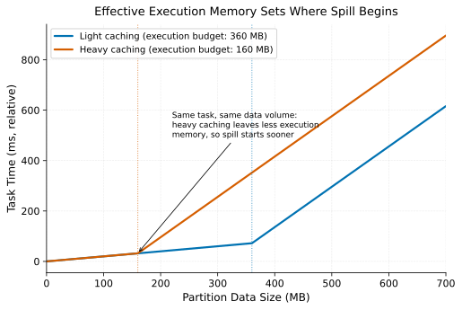

# Memory Management

> **One-liner:** The split between execution and storage memory, and what happens when one starves the other under load.

## Symptom

- A job that reliably completes fails intermittently with out-of-memory errors under
  load that looks, by aggregate metrics, no different from successful runs.
- Enabling caching (`persist()`/`cache()`) for a frequently-reused DataFrame makes an
  unrelated shuffle-heavy stage start spilling or failing, with no apparent connection
  between the two.
- Garbage collection time as a fraction of total task time climbs steadily over a long-
  running job or streaming application, eventually dominating wall-clock time.
- Two jobs with similar data volumes but different operator mixes (one join-heavy, one
  cache-heavy) need very different memory configurations to run reliably.

## Mechanism

An executor's JVM heap (in JVM-based engines) is divided into regions with different
purposes and different eviction rules, and understanding which region a given operation
draws from explains most memory-related instability.

**Execution memory** backs operators that need working space during computation:
shuffles, sorts, joins, aggregations (see
[Spill to Disk](../joins-and-shuffle/spill-to-disk.md) for what happens when this
region is exceeded). This memory is transient — it's needed only while the operator
runs and is released afterward.

**Storage memory** backs cached/persisted data and broadcast variables — data
deliberately kept in memory across operations, for as long as the caller wants it
retained.

Modern unified memory management (Spark's `UnifiedMemoryManager` being the canonical
example) allows these two regions to borrow from each other under a soft boundary: if
execution needs more memory than its nominal share and storage isn't using its full
share, execution can borrow storage's unused portion, and vice versa. This is more
efficient on average than a hard, fixed split, but it means the *effective* memory
budget for either purpose depends on what the other is doing concurrently — a job's
execution memory pressure at any moment is a function of how much cached data happens
to be resident, not a fixed, predictable quantity.

This is precisely why caching an unrelated DataFrame can destabilize a shuffle-heavy
stage elsewhere in the same job or application: the cached data occupies storage
memory that execution could otherwise have borrowed, tightening the effective execution
budget and making spill (or outright OOM, if eviction can't free enough) more likely,
even though the two operations look unrelated in the code.

The same partition size, under heavier caching elsewhere in the application, crosses
into spill sooner — the task itself hasn't changed, only how much of the unified memory
pool storage happened to be holding at the time.

Garbage collection pressure compounds this: JVM-based engines pay GC cost proportional
to live object count and heap churn, and an execution region under memory pressure
churns through short-lived objects (partial sort buffers, hash table entries) faster,
increasing GC frequency and pause time — which is why sustained memory pressure often
shows up first as rising GC time rather than as an immediate failure.

## Real-world sightings

Spark's own documentation on unified memory management describes the borrowing
behavior between execution and storage regions directly, including the eviction
policy storage memory is subject to when execution needs to reclaim borrowed space (LRU
eviction of cached blocks) — and explicitly notes that execution memory, unlike storage
memory, cannot be evicted to make room for storage, reflecting that correctness
(execution must complete) is prioritized over the caching optimization.

GC tuning for Spark applications is a substantial, recurring topic across Databricks
and other vendor engineering documentation, generally converging on the same
diagnostic pattern: rising GC time as a leading indicator of insufficient execution
memory headroom, often traced back to over-aggressive caching or an undersized
executor relative to the job's actual shuffle and aggregation memory needs.

## Mitigations

### Tuning `memory.fraction` deliberately, not by default

**What it is:** Explicitly size the unified memory region and the storage/execution
split based on the actual mix of caching and shuffle-heavy operations in a given
workload, rather than accepting defaults tuned for a generic workload.

**Cost:** Requires workload-specific profiling; a setting tuned for one job's operator
mix may be wrong for another job sharing the same cluster configuration.

**How it backfires:** A workload's operator mix changes over time (a job that starts
cache-light and grows cache-heavy as more downstream consumers are added) without a
corresponding re-tuning, silently eroding the headroom the original tuning assumed.

### Unpersisting proactively

**What it is:** Explicitly release cached DataFrames (`unpersist()`) once they're no
longer needed, rather than relying on LRU eviction under pressure.

**Cost:** Requires tracking cache lifetime manually in application code, which is easy
to omit for data that's cached "just in case" and never explicitly cleaned up.

**How it backfires:** Proactive unpersisting that happens too early forces
recomputation of data that a later stage did in fact need, trading a memory problem for
a redundant-compute problem.

### Right-sizing executors for the operator mix

**What it is:** Choose executor memory and count based on the specific mix of
shuffle-heavy vs. cache-heavy operations the job performs, rather than a one-size
default across a cluster.

**Cost:** Requires per-job or per-workload-class configuration rather than a single
cluster-wide default, adding operational complexity.

**How it backfires:** As with partition count tuning (see
[Shuffle Partitioning Strategy](../joins-and-shuffle/shuffle-partitioning-strategy.md)),
a memory configuration tuned for today's operator mix and data volume degrades
silently as either changes, with no warning short of the next OOM or spill event.

## Interactions

- [Spill to Disk](../joins-and-shuffle/spill-to-disk.md) — the direct consequence of
  execution memory pressure exceeding its effective (post-borrowing) budget.
- [Data Skew & Salting](../joins-and-shuffle/data-skew-and-salting.md) — a skewed
  partition's memory demand is concentrated on a single task, which can exhaust that
  task's share of execution memory even when the job's aggregate memory usage looks
  fine.
- [Serialization & Tungsten](serialization-and-tungsten.md) — off-heap binary encoding
  changes where and how memory pressure manifests, moving some allocation outside the
  JVM heap's GC-managed region entirely.

## References

- Apache Spark Documentation. *Tuning Spark — Memory Management Overview*. Describes
  the unified memory manager's execution/storage borrowing and eviction rules.
- Databricks Engineering Blog. *Tuning Java Garbage Collection for Apache Spark
  Applications*. Connects GC pressure to memory region exhaustion diagnostically.
- Zaharia, M. et al. *Resilient Distributed Datasets: A Fault-Tolerant Abstraction for
  In-Memory Cluster Computing*. NSDI 2012. Original description of RDD persistence
  levels and their relationship to storage memory.
