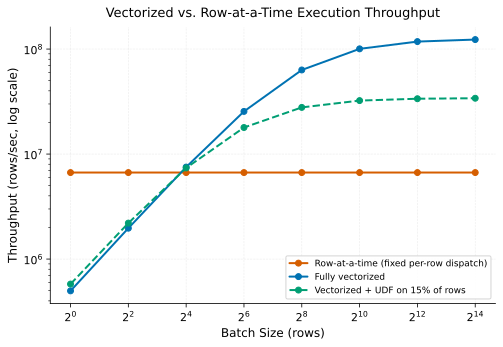

# Vectorized Execution

> **One-liner:** Processing columns in batches instead of rows amortizes per-row interpretation overhead, at the cost of specialized code paths.

## Symptom

- Two scans over similarly sized data show very different CPU profiles: one dominated
  by per-row interpretation overhead, the other by the actual arithmetic being
  performed.
- Enabling a "vectorized reader" configuration flag produces a large speedup on a scan
  with no other changes.
- A query involving a complex or unsupported expression type falls back to a
  noticeably slower row-at-a-time execution path, without an obvious error indicating
  the fallback occurred.
- CPU utilization per core is far below expected for a computation that should be
  CPU-bound, suggesting overhead rather than genuine compute is the bottleneck.

## Mechanism

Traditional row-at-a-time query execution processes one row fully through the
operator tree before moving to the next: for every row, the engine dispatches to the
appropriate function for each operator (a filter check, an arithmetic expression, a
comparison), incurring the interpretation and dispatch overhead of a general-purpose
execution engine on every single row.

Vectorized execution restructures this around batches of rows (typically a few
thousand) processed one *column* at a time: for a given operator, all rows in the batch
have that operator applied together, as a tight loop over a contiguous array of values
— closer to how a compiled, specialized numeric routine operates than a general
interpreter. This amortizes the per-operation dispatch overhead across an entire
batch rather than paying it per row, and — because operations run over contiguous
memory — benefits from CPU cache locality and, in many implementations, SIMD
(single-instruction-multiple-data) hardware instructions that operate on several values
per CPU cycle.

The tradeoff is that vectorized code paths have to be written and specialized per
supported operation, and not every expression type has (or can efficiently have) a
vectorized implementation — a sufficiently exotic expression, or one involving a
row-at-a-time UDF (see [Serialization & Tungsten](../spark-internals/serialization-and-tungsten.md)
for the related deserialization-boundary cost), forces a fallback to the row-at-a-time
path for at least the portion of the plan that expression appears in. This fallback is
usually silent from a correctness standpoint — the query still returns correct results
— but it forfeits the vectorization benefit for that portion of the plan, and the
resulting performance gap between "fully vectorized" and "fell back partway" can be
large and non-obvious from the query text alone.

Row-at-a-time throughput is flat regardless of batch size, since its per-row dispatch
cost doesn't amortize. Vectorized throughput rises with batch size as fixed per-batch
overhead is spread across more rows — but a UDF forcing even a small fraction of rows
through the row-wise fallback path pulls the blended throughput down disproportionately,
because that fraction pays the much higher per-row cost regardless of how well the rest
of the batch vectorizes.

## Real-world sightings

Databricks' Photon engine, described in their SIGMOD 2022 paper ("Photon: A
Fast Query Engine for Lakehouse Systems"), is built around a vectorized execution model
specifically as a response to the overhead of row-at-a-time JVM execution, reporting
substantial throughput improvements attributable largely to vectorized processing and
native code generation working together, rather than either technique alone.

The general vectorized-execution technique predates any single vendor's implementation
— MonetDB/X100's "vectorized" execution model (Boncz, Zukowski, and Nes, "MonetDB/X100:
Hyper-Pipelining Query Execution," CIDR 2005) is one of the foundational papers
establishing that batch-at-a-time, column-oriented execution substantially outperforms
row-at-a-time interpretation for analytical workloads, a finding that has since been
adopted broadly across analytical engines (Presto/Trino, ClickHouse, DuckDB, and Spark's
own vectorized Parquet reader).

## Mitigations

### Enabling vectorized readers and execution paths

**What it is:** Turn on vectorized scan and execution configuration where available
(many engines default to this today, but older configurations or specific connectors
may not).

**Cost:** Vectorized code paths sometimes have different edge-case behavior (type
coercion, null handling) than the row-at-a-time path they replace, requiring
validation when migrating.

**How it backfires:** None specific to enabling it correctly — the risk is in *not*
verifying which operations in a specific query actually hit the vectorized path versus
silently falling back.

### Avoiding row-at-a-time UDFs in vectorizable pipelines

**What it is:** Prefer built-in vectorized expressions over custom row-at-a-time
functions in scans and transformations that would otherwise be fully vectorized.

**Cost:** Some logic genuinely requires custom code that isn't expressible as a
built-in vectorized operation.

**How it backfires:** A single row-at-a-time UDF inserted into an otherwise vectorized
pipeline can force a fallback for the entire surrounding operator chain, not just the
UDF's own cost — the loss is often disproportionate to the UDF's apparent scope in the
query.

### Profiling to detect silent fallback

**What it is:** Check execution plans or profiling output for indications that a
specific query or expression fell back to a non-vectorized path, rather than assuming
vectorization applied throughout.

**Cost:** Requires engine-specific tooling or plan inspection to detect, since fallback
doesn't produce an error or warning by default in most engines.

**How it backfires:** Without this check, teams commonly attribute a performance
regression to "the data grew" when the actual cause was an expression change that
silently disabled vectorization for an otherwise-unchanged query.

## Interactions

- [Columnar Storage Formats](columnar-storage-formats.md) — vectorized execution is
  most naturally paired with columnar storage, since both operate on contiguous
  per-column data.
- [Serialization & Tungsten](../spark-internals/serialization-and-tungsten.md) — the
  Spark-specific mechanism (whole-stage code generation over binary-encoded rows) that
  achieves a closely related performance goal via a different technique.
- [Predicate & Projection Pushdown](predicate-and-projection-pushdown.md) — pushdown
  reduces the *volume* of data reaching execution; vectorization reduces the
  *per-row cost* of processing whatever volume does reach it — the two compound.

## References

- Ghodsnia, P. et al. (Databricks). *Photon: A Fast Query Engine for Lakehouse
  Systems*. SIGMOD 2022. Modern vectorized engine design and its measured impact.
- Boncz, P., Zukowski, M., and Nes, N. *MonetDB/X100: Hyper-Pipelining Query
  Execution*. CIDR 2005. Foundational paper establishing vectorized execution's
  performance advantage over row-at-a-time interpretation.
- Apache Parquet / Apache Spark Documentation. *Vectorized Parquet Reader*. Describes
  the vectorized scan path and its interaction with columnar file formats.
