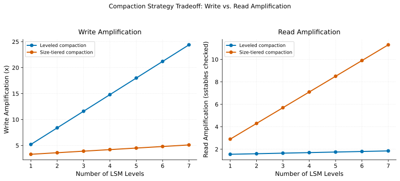

# Compaction Strategies

> **One-liner:** Compaction trades write amplification now for read amplification later; falling behind on either creates a debt that compounds.

## Symptom

- A table accumulates a very large number of small files relative to its total data
  volume, and query planning or listing time grows disproportionately to actual data
  size.
- A compaction job that used to complete comfortably within its scheduled window takes
  progressively longer each run, eventually failing to keep pace with new writes.
- Read latency for a table degrades gradually over time between compaction runs, then
  improves sharply right after compaction completes, producing a visible sawtooth
  pattern in query performance.
- Disk or storage usage for a table is noticeably higher than its logical data size
  would suggest, traceable to multiple overlapping, not-yet-compacted versions of
  similar data.

## Mechanism

Compaction merges many small files (or many overlapping versions of the same logical
data) into fewer, larger, non-overlapping ones. It exists because small-file
accumulation degrades read performance in a way that compounds: per-file overhead (open,
list, read per-chunk statistics — see
[The Memory & I/O Hierarchy](../../foundations/the-memory-and-io-hierarchy.md) for why
object-store request overhead dominates for small reads) is paid once per file, so a
logical dataset split across many small files costs far more to read than the same data
in fewer, larger files, even at identical total byte volume.

This creates a genuine trade, not a free optimization: compaction itself is a
read-and-rewrite operation, consuming I/O and compute proportional to the data being
compacted, paid *in addition to* whatever cost produced the small files in the first
place. The engineering tradeoff is choosing how much of this cost to pay, and when: **write
amplification** — compacting aggressively and often, rewriting recently-written data
repeatedly as new small writes arrive — trades ongoing compute cost for consistently
good read performance. **Read amplification** — compacting rarely, letting small files
accumulate — defers that cost but degrades read performance for every query that runs
against the table before the next compaction pass.

The genuinely dangerous failure mode is falling behind: if new small files accumulate
faster than compaction can consolidate them, the backlog grows, and — because compacting
a larger backlog takes proportionally longer — each subsequent compaction run has more
work to do than the last, potentially never catching up. This is the same
debt-compounding failure as an under-provisioned queue that never drains — see
[Backpressure in Streaming](../streaming/backpressure-in-streaming.md) for the same
falling-behind mechanism applied to message backlogs instead of file accumulation.

Different storage engines make different default tradeoffs here. LSM-tree-based systems
(see [B-Tree vs. LSM-Tree Tradeoffs](../indexing/btree-vs-lsm-tree.md)) have compaction
as a core, continuous part of their design, with tunable strategies (size-tiered vs.
leveled compaction) that trade write amplification against read amplification and space
amplification differently. Lakehouse table formats (Iceberg, Delta, Hudi) treat
compaction as a periodic maintenance operation layered on top of otherwise
immutable file writes, generally run on a schedule or triggered by small-file count
thresholds rather than continuously.

Leveled compaction pays steadily rising write amplification as level count grows, in
exchange for read amplification that stays low and roughly flat. Size-tiered compaction
inverts this: write amplification stays low, but read amplification rises as more
overlapping sstables accumulate per level — the same tradeoff described above, made
concrete.

## Real-world sightings

The general size-tiered vs. leveled compaction tradeoff is extensively documented in
LSM-tree literature and production database engineering (Cassandra, RocksDB, LevelDB
documentation all describe this choice explicitly): size-tiered compaction has lower
write amplification but higher space amplification (multiple redundant copies can
coexist longer before merging) and worse read amplification (more sstables may need
checking per read); leveled compaction has the opposite profile.

Delta Lake, Iceberg, and Hudi project documentation each describe "optimize" or
"compaction" operations as an explicitly necessary, ongoing maintenance task —
not a one-time setup step — with Hudi in particular offering both synchronous
(inline) and asynchronous compaction scheduling specifically to let operators tune how
aggressively write amplification is traded against read-side small-file accumulation
based on their workload's write pattern.

## Mitigations

### Scheduling compaction to run ahead of accumulation rate

**What it is:** Run compaction frequently enough, relative to write rate, that the
small-file backlog never grows faster than compaction can consume it.

**Cost:** More frequent compaction consumes more ongoing compute and I/O, competing
with the cluster's other workloads for the same resources.

**How it backfires:** A compaction schedule tuned for a given write rate becomes
insufficient if write rate grows, and because a growing backlog makes each subsequent
compaction run take longer, the system can cross from "keeping up" to "falling behind"
without an obvious single trigger — it looks like gradual degradation until it's a
genuine backlog.

### Choosing size-tiered vs. leveled compaction for the actual workload

**What it is:** For LSM-based storage, select a compaction strategy matching the
workload's actual read/write ratio — leveled for read-heavy workloads willing to pay
more write amplification, size-tiered for write-heavy workloads that can tolerate more
read-side variance.

**Cost:** Requires understanding the workload's actual read/write balance, which can
shift over a table's lifetime as its usage evolves.

**How it backfires:** A strategy chosen for an initial, write-heavy bulk-load phase can
be poorly suited to the table's later, read-heavy steady-state phase, and switching
compaction strategy after the fact typically requires a full rewrite, not an
incremental transition.

### Monitoring small-file count and compaction backlog explicitly

**What it is:** Track small-file count (or the equivalent backlog metric for the
storage engine in use) as a first-class operational signal, rather than discovering
compaction debt only through degraded query performance.

**Cost:** Requires instrumentation and alerting specifically for this metric, which
isn't always exposed by default.

**How it backfires:** None specific — the absence of this monitoring is itself the
failure mode, since without it, compaction debt is discovered reactively rather than
proactively.

## Interactions

- [B-Tree vs. LSM-Tree Tradeoffs](../indexing/btree-vs-lsm-tree.md) — LSM-tree
  compaction strategy (size-tiered vs. leveled) is the specific instance of this
  pattern's tradeoff for that storage engine family.
- [Row vs. Columnar File Formats](row-vs-columnar-file-formats.md) — small-file
  accumulation is especially costly for columnar formats, since it fragments the
  per-chunk statistics that enable pushdown pruning.
- [Table Formats & Metadata Layers](table-formats-and-metadata-layers.md) — lakehouse
  table formats' metadata layer requires its own, related but distinct compaction
  process, separate from data-file compaction.

## References

- O'Neil, P. et al. *The Log-Structured Merge-Tree (LSM-Tree)*. Acta Informatica, 1996.
  Foundational description of the write/read/space amplification tradeoffs compaction
  strategy selection is built around.
- Apache Cassandra Documentation. *Compaction*. Describes size-tiered vs. leveled
  compaction strategy selection for LSM-based storage.
- Apache Hudi Documentation. *Compaction*. Describes synchronous vs. asynchronous
  compaction scheduling for lakehouse table formats.
