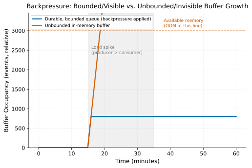

# Backpressure in Streaming

> **One-liner:** When a downstream stage can't keep up, buffers grow somewhere — the question is whether that growth is bounded and visible.

## Symptom

- Consumer lag (or an equivalent queue-depth metric) grows steadily during a load spike
  and doesn't recover on its own once the spike passes, even though instantaneous
  throughput has returned to normal.
- Memory usage on a specific stage of a streaming pipeline climbs continuously until a
  restart, traceable to an internal buffer that has no configured upper bound.
- A downstream sink's latency increase (a slow database, a throttled external API)
  propagates upstream into growing lag at the source, even though the source and
  intermediate stages haven't themselves changed behavior.
- Restarting a lagging pipeline "fixes" throughput temporarily, but lag resumes growing
  at the same rate shortly afterward, because the underlying capacity mismatch was
  never addressed.

## Mechanism

In any multi-stage pipeline, if a downstream stage processes events slower than an
upstream stage produces them, the excess has to go somewhere — it can't simply
vanish. Three general outcomes are possible: it accumulates in an in-memory buffer
(risking unbounded memory growth), it accumulates in a durable queue (Kafka's own
partition log serving as the buffer, which is why consumer lag is a directly visible
metric), or an explicit backpressure signal propagates upstream, slowing the producer
to match what the consumer can actually sustain.

The critical distinction is between **bounded, visible** backpressure and **unbounded,
invisible** buffering. A pipeline built on a durable log (Kafka) gets a form of
backpressure almost for free: the log itself absorbs the mismatch, and consumer lag —
the gap between produced and consumed offsets — is a directly observable metric that
grows precisely in proportion to the capacity mismatch. A pipeline stage with an
unbounded internal queue (a naive in-memory buffer between processing steps, with no
configured maximum) instead grows silently until it exhausts available memory,
producing an OOM failure that gives no advance warning proportional to the severity of
the mismatch — the failure is binary (fine, then crashed) rather than gradual and
observable.

Both scenarios face the same load spike. The bounded queue's lag rises during the spike
and holds once backpressure engages, recovering as load normalizes. The unbounded buffer
has no such ceiling — it keeps growing for as long as the mismatch persists, crossing
available memory with no earlier signal that a failure was imminent.

This means the correct response to "my pipeline is falling behind" depends entirely on
which of these outcomes is occurring: if lag is growing on a durable, bounded queue,
the fix is capacity (more consumer parallelism, faster per-event processing, or
propagating backpressure to the source) applied deliberately; if an internal, unbounded
buffer is growing, the more urgent problem is that the pipeline has no backpressure
mechanism at all, and adding one (even a crude one, like blocking upstream production
once an internal buffer reaches a threshold) is the more foundational fix.

## Real-world sightings

Reactive Streams (the specification underlying much of the JVM's stream-processing
backpressure model, and later incorporated into Akka Streams and Project Reactor)
explicitly defines backpressure as a first-class protocol concern: a subscriber signals
how much data it can currently accept, and a well-behaved publisher respects that signal
rather than pushing data faster than the subscriber requested — a design directly
motivated by the failure mode of unbounded internal buffering under a
producer/consumer speed mismatch.

Consumer lag as the primary operational signal for backpressure-related problems in
Kafka-based pipelines is a standard practice extensively documented across Kafka
operational guides and consumer-group monitoring tooling, generally framed around the
principle that lag growth during a load spike is expected and recoverable, while lag
that fails to recover once load normalizes indicates a genuine capacity shortfall
rather than a transient blip.

## Mitigations

### Building on a durable, bounded log rather than unbounded in-memory queues

**What it is:** Use a durable message log (Kafka or equivalent) as the buffer between
pipeline stages, so backpressure manifests as observable, bounded lag rather than
silent, unbounded memory growth.

**Cost:** Durable logs add write latency and storage cost compared to a purely
in-memory hand-off between stages.

**How it backfires:** A durable log bounds the *failure mode* (visible lag instead of
an OOM) but doesn't bound the *lag itself* — a log with unlimited retention can still
grow its backlog indefinitely if the underlying capacity mismatch is never addressed,
just without crashing.

### Explicit backpressure signaling between stages

**What it is:** Propagate an explicit "slow down" signal from a saturated downstream
stage back to its upstream producer, rather than letting the producer push data at an
unconstrained rate.

**Cost:** Requires the messaging/processing framework to support this signaling
protocol end-to-end; a mixed pipeline (some backpressure-aware components, some not)
only gets the benefit where both sides support it.

**How it backfires:** Backpressure signaling that stops at some intermediate boundary
(a stage that respects it internally but doesn't propagate the signal further
upstream) still allows unbounded buildup before that boundary, giving a false sense
that the whole pipeline is backpressure-safe when only part of it is.

### Alerting on lag growth rate, not just lag magnitude

**What it is:** Monitor whether lag is *recovering* after a load spike, not just its
absolute value, since transient lag growth during a spike is expected and a
non-recovering trend indicates a genuine capacity shortfall.

**Cost:** Requires more sophisticated alerting logic than a simple threshold on
absolute lag.

**How it backfires:** A recovery-rate-based alert tuned for typical spike patterns can
be slow to fire for a genuinely severe, fast-onset capacity shortfall if its recovery
window is set too generously.

## Interactions

- [Kafka Partitioning & Consumer Groups](kafka-partitioning-and-consumer-groups.md) — an
  undersized partition count is a structural cause of backpressure that no amount of
  consumer-side tuning can resolve, since parallelism is capped by partition count.
- [Checkpointing & Fault Tolerance](checkpointing-and-fault-tolerance.md) — a pipeline
  under sustained backpressure has a growing replay window if it fails, since more
  unprocessed data accumulates the longer the mismatch persists.
- [Query Admission Control & Workload Management](../query-systems/query-admission-control.md) —
  the batch/query-system analog of the same principle: reject or queue excess demand
  explicitly rather than letting it accumulate invisibly.

## References

- Reactive Streams Specification. *reactive-streams.org*. Defines the
  subscriber-driven demand signaling protocol underlying much of the JVM streaming
  ecosystem's backpressure handling.
- Apache Kafka Documentation. *Monitoring Consumer Lag*. Operational guidance on lag as
  the primary backpressure-related signal in Kafka-based pipelines.
- Akidau, T. et al. *The Dataflow Model*. VLDB 2015. Discusses the relationship between
  processing rate, buffering, and correctness in unbounded stream processing.
