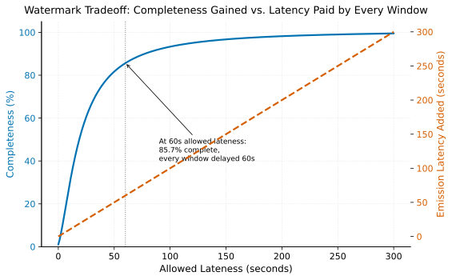

# Watermarks & Late Data

> **One-liner:** A watermark is a bet about how late data can arrive; set it wrong and you trade completeness for latency in either direction.

## Symptom

- A windowed aggregation's output for a given window is emitted, and a later
  reconciliation against a batch recomputation of the same period shows the streaming
  result was measurably incomplete.
- Increasing a watermark's allowed lateness reduces discrepancies against batch
  recomputation but increases the delay before any window's result is emitted.
- A mobile or IoT data source with unusually long offline-buffering behavior causes
  disproportionate late-data drops compared to other sources feeding the same pipeline.
- Late-arriving data is silently dropped with no visible error or warning, discovered
  only through downstream reconciliation rather than through the pipeline's own
  monitoring.

## Mechanism

A watermark is an assertion, propagated through a streaming pipeline, of the form "no
more data with an event timestamp earlier than T should be expected from here on." It's
the mechanism that lets a window-based aggregation decide a window is complete and emit
its result, rather than waiting indefinitely for data that may never arrive (see
[Event Time vs. Processing Time](../../foundations/event-time-vs-processing-time.md)
for why this decision can't be made trivially from processing time alone).

The watermark is necessarily a heuristic, not a guarantee grounded in the data itself —
it's typically computed as "the maximum event timestamp seen so far, minus some
configured allowed lateness." Setting the allowed lateness is a direct tradeoff: a
short allowed lateness closes windows quickly (low latency) but data arriving later than
that bound is either dropped or handled as a separate, explicit late-data path;
a long allowed lateness accommodates slower sources but delays every window's result by
that same margin, even for the (typically large majority of) data that isn't actually
late.

Completeness rises steeply at first as allowed lateness grows past the bulk of the
arrival-delay distribution, then flattens — chasing the last few percent of stragglers
costs a disproportionate amount of added latency, and that added latency is paid by
*every* window, not just the ones that had late data.

This tradeoff is fundamentally about the tail latency of the *sources* feeding the
pipeline, not a property the pipeline itself controls. A source population with a wide
range of arrival-delay behavior — some producers online and low-latency, others (mobile
clients that buffer offline, IoT devices with intermittent connectivity) capable of
delivering data hours or days late — has no single watermark setting that is
simultaneously fast and complete, because the same setting has to serve both the
typical low-latency producer and the atypical high-latency one. This is why "late data"
handling frequently requires acknowledging that a single global watermark policy is a
compromise, and some architectures use per-key or per-source watermarking, or emit
retraction/correction records for windows re-opened by genuinely late data, rather than
treating a window's first emission as immutably final.

## Real-world sightings

The Dataflow Model paper (Akidau et al., "The Dataflow Model: A Practical Approach to
Balancing Correctness, Latency, and Cost in Massive-Scale, Unbounded, Out-of-Order Data
Processing," VLDB 2015) is the foundational reference establishing watermarks,
triggers, and accumulation modes as the general framework for reasoning about this exact
tradeoff, explicitly separating "when in processing time are results materialized"
(triggers) from "what event-time completeness does the system believe it has"
(watermarks) — a decomposition subsequently adopted by Apache Beam, Flink, and Spark
Structured Streaming's own watermarking APIs.

Flink's documentation on watermarks and the "allowed lateness" configuration for
windowed operators directly describes the completeness/latency tradeoff and the
explicit late-data side-output mechanism for records that arrive after a window has
already fired, reflecting the same design: rather than pretending the tradeoff doesn't
exist, make the discarded-or-late path an explicit, observable part of the pipeline
rather than a silent drop.

## Mitigations

### Setting watermark lateness from observed source behavior, not defaults

**What it is:** Measure the actual distribution of event-time-to-processing-time delay
across real producers feeding the pipeline, and set allowed lateness based on that
distribution (e.g., covering the 99th percentile of observed delay) rather than an
arbitrary default.

**Cost:** Requires ongoing measurement, since the delay distribution can shift as
client populations, network conditions, or producer behavior change.

**How it backfires:** A watermark tuned to a historical delay distribution becomes
miscalibrated if a new client version, a new region, or a new producer type introduces
a meaningfully different delay pattern, and nothing alerts on this until completeness
checks (if they exist) surface a discrepancy.

### Explicit late-data side-outputs

**What it is:** Route data that arrives after a window has already closed to a
separate, explicitly monitored path (a side-output stream or a correction/retraction
record) rather than silently dropping it.

**Cost:** Adds pipeline complexity — downstream consumers now need to handle both the
initial window result and possible subsequent corrections.

**How it backfires:** If downstream consumers don't actually process the correction
path (a common gap when it's added as an afterthought), routing late data to a side
output that nothing reads is functionally equivalent to dropping it, just with extra
plumbing.

### Reconciling streaming output against periodic batch recomputation

**What it is:** Periodically recompute the same aggregation from a complete, bounded
batch source (once all data for a period is known to have arrived) and reconcile
against the streaming result, correcting or flagging discrepancies.

**Cost:** Requires maintaining both a streaming and a batch code path for the same
logical computation, with the operational overhead of keeping them consistent.

**How it backfires:** This mitigation catches discrepancies after the fact but doesn't
prevent them — for use cases where the streaming result is consumed immediately and
irreversibly (a real-time decision, an alert), after-the-fact reconciliation doesn't
undo whatever action was already taken on the incomplete data.

## Interactions

- [Event Time vs. Processing Time](../../foundations/event-time-vs-processing-time.md) —
  the foundational concept watermarks operationalize into an explicit, actionable
  policy.
- [Windowing Strategies](windowing-strategies.md) — watermarks are the mechanism that
  determines when a window (of any strategy) is considered closed and ready to emit.
- [Checkpointing & Fault Tolerance](checkpointing-and-fault-tolerance.md) — watermark
  state itself has to be checkpointed alongside other pipeline state to survive a
  failure without losing completeness tracking.

## References

- Akidau, T. et al. *The Dataflow Model: A Practical Approach to Balancing Correctness,
  Latency, and Cost in Massive-Scale, Unbounded, Out-of-Order Data Processing*. VLDB
  2015. The foundational watermark/trigger/accumulation framework.
- Apache Flink Documentation. *Generating Watermarks* and *Allowed Lateness*. Describes
  practical watermark configuration and explicit late-data side-output handling.
- Apache Beam Documentation. *Windowing, Watermarks, and Triggers*. Cross-engine
  reference implementing the Dataflow Model's concepts.
